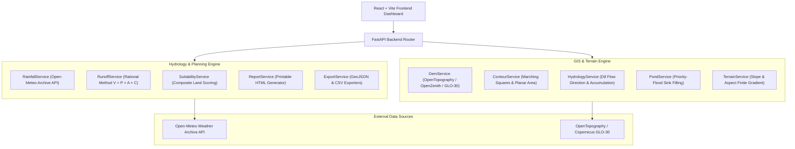

# VILLAGE POND PLANNING SYSTEM 🛰️💧

> **AI/GIS-Based Academic Decision Support System** for identifying suitable village pond construction sites using geospatial Digital Elevation Models (DEMs), Open-Meteo historical rainfall data, Rational Method runoff estimation, weighted composite terrain suitability modeling, and interactive 3D/basemap visualizers.

---

## 🌟 Key Capabilities & Features

- **Geospatial Location Search**: Geocoding via Nominatim/OpenStreetMap with automatic ROI bounding box calculation.
- **Multi-Source DEM Pipeline**: On-the-fly acquisition via OpenTopography (COP30/SRTMGL1), OpenZenith (Copernicus GLO-30), OpenTopoData, or fallback coordinate-seeded Perlin noise.
- **Basemap Imagery Switcher**: Instant switching between **ESRI World Imagery (Satellite)**, **CartoDB Dark (Street)**, and **OpenTopoMap (Topographic)** layers.
- **Marching Squares Contour Generation**: Fast contour polyline extraction at customizable intervals (10m, 20m, 50m, 100m) with polyline length (m/km), vertex count, and enclosed area ($m^2$/$km^2$ via local planar projection).
- **Slope & Aspect Engine**: Finite-difference gradient field calculation with interactive YlOrRd slope heatmap overlays.
- **D8 Hydrological Engine**:
  - D8 steepest-descent flow direction matrix calculation.
  - **Flow Accumulation Grid** calculating upstream cell counts across the entire region.
  - Water droplet flow path simulation with animated Leaflet droplets.
  - Stream network extraction at customizable accumulation thresholds.
  - Watershed catchment delineation using reverse BFS from any outlet point.
- **Open-Meteo Historical Rainfall API**:
  - Fetches 10+ years of daily precipitation records (1940–present).
  - Summarizes annual averages, monsoon totals (Jun–Sep), monthly distributions, and climate aridity classification (Arid, Semi-Arid, Sub-Humid, Humid, Very Humid).
- **Surface Runoff Estimation Engine**:
  - Calculates annual runoff volume using the **Rational Method** ($V = P \times A \times C$).
  - Configurable land-use presets ($C = 0.15 \dots 0.85$).
- **Candidate Pond Site Detection & Suitability Scoring**:
  - Identifies top-N candidate pond sites across the region with minimum spatial separation.
  - Weighted composite suitability scoring ($0 \dots 100$) based on slope, depression depth, flow accumulation, elevation, and rainfall.
  - Tier classification (**Recommended**, **Highly Suitable**, **Moderately Suitable**, **Poor**) with explicit "Why This Site?" reasons.
- **Recommendation Dashboard & Panels**:
  - Interactive **Recommendation Panel** featuring score breakdown ring, depth/volume/surface estimates, and map auto-focus.
  - **Candidate Sites Drawer** listing all ranked sites with tier colors and direct export buttons.
- **Printable Analysis Report Generation**:
  - HTML report generator producing print-ready planning documents complete with location maps, DEM stats, rainfall charts, runoff formulas, candidate site tables, methodology, and data source citations.
- **Data Exporting**:
  - Contours: GeoJSON / CSV
  - Candidate Pond Sites: GeoJSON / CSV
  - Watershed Catchment Boundary: GeoJSON
  - Elevation Profile Transects: CSV

---

## 🏗️ System Architecture



---

## 📐 Mathematical & Hydrological Foundations

### 1. Contour Generation (Marching Squares)
Each grid cell formed by 4 neighboring DEM elevation values $[E_{00}, E_{01}, E_{10}, E_{11}]$ is classified against a target elevation threshold $C$. Each vertex produces a 1-bit binary flag:

$$b_i = \begin{cases} 1 & \text{if } E_i \ge C \\ 0 & \text{if } E_i < C \end{cases}$$

The 4-bit index $k = \sum_{i=0}^3 b_i 2^i \in [0, 15]$ indexes a lookup table to place interpolated contour line segment endpoints along cell edges via linear interpolation:

$$t = \frac{C - E_A}{E_B - E_A} \implies P = (1 - t)P_A + t P_B$$

### 2. Physical Distance & Planar Area Calculations
- **Haversine Geodesic Distance**:
  $$d = 2 R \arcsin \left( \sqrt{ \sin^2\left(\frac{\Delta \phi}{2}\right) + \cos(\phi_1) \cos(\phi_2) \sin^2\left(\frac{\Delta \lambda}{2}\right) } \right)$$
- **Local Planar Projection Area**: Polygons are projected onto planar meter coordinates at the centroid latitude ($\phi_c$) using scale factors:
  $$\Delta y = \Delta \phi \times 111,000 \text{ m}, \quad \Delta x = \Delta \lambda \times 111,000 \cos(\phi_c) \text{ m}$$
  Area is computed via the Shoelace Formula:
  $$\text{Area} = \frac{1}{2} \left| \sum_{i=1}^{n-1} (x_i y_{i+1} - x_{i+1} y_i) + (x_n y_1 - x_1 y_n) \right|$$

### 3. Slope & Aspect Field
Local elevation gradients $\frac{\partial E}{\partial x}$ and $\frac{\partial E}{\partial y}$ are computed using central finite differences:

$$\text{Slope (°)} = \arctan \sqrt{\left(\frac{\partial E}{\partial x}\right)^2 + \left(\frac{\partial E}{\partial y}\right)^2} \times \frac{180}{\pi}$$

$$\text{Aspect (Compass °)} = \left( 450^\circ - \text{atan2}\left(-\frac{\partial E}{\partial y}, \frac{\partial E}{\partial x}\right) \times \frac{180}{\pi} \right) \bmod 360^\circ$$

### 4. D8 Flow Direction & Flow Accumulation
Flow direction is assigned to the neighbor in the $3 \times 3$ cell window with maximum downward gradient:

$$\text{Drop}_{i,j} = \frac{E_{\text{center}} - E_{i,j}}{\text{Distance}_{i,j}}$$

Flow accumulation ($A_{\text{cell}}$) is computed recursively or iteratively, counting the total number of upstream contributing cells that drain into each target cell.

### 5. Depression Sink Filling (Priority-Flood)
Depression sinks are identified using the Priority-Flood algorithm (Wang & Liu 2006). For each cell in a labeled depression:

$$V_{\text{total}} = \sum_{(r,c) \in \text{Depression}} \max(0, E_{\text{water level}} - E_{r,c}) \times A_{\text{pixel}}$$

### 6. Surface Runoff Estimation (Rational Method)
Annual surface runoff volume ($V$) is estimated using:

$$V = P \times A \times C$$

Where:
- $P$ = Annual rainfall depth ($\text{m}$)
- $A$ = Catchment area ($\text{m}^2$)
- $C$ = Dimensionless runoff coefficient ($0.05 \le C \le 0.95$)

### 7. Land Suitability Scoring Model
Each DEM grid cell is evaluated across 5 normalized score components ($S_i \in [0, 1]$):
1. **Slope Score** ($S_{\text{slope}} = \frac{1}{1 + \text{slope} / 8.0}$)
2. **Depression Score** ($S_{\text{dep}} = \frac{\text{fill depth}}{\max(\text{fill depth})}$)
3. **Catchment Score** ($S_{\text{cat}} = \frac{\ln(1 + A_{\text{cell}})}{\max(\ln(1 + A_{\text{cell}}))}$)
4. **Elevation Score** ($S_{\text{elev}} = 1 - \frac{E - E_{\min}}{E_{\max} - E_{\min}}$)
5. **Rainfall Score** ($S_{\text{rain}} = \min(1, \text{Rainfall}_{\text{mm}} / 800)$)

Composite Suitability Score ($S \in [0, 100]$):

$$S = 100 \times \sum_{i=1}^5 w_i S_i \quad \text{where } \sum w_i = 1.0$$

---

## 🛠️ Technology Stack

- **Backend Framework**: Python 3.12, FastAPI, Uvicorn, Pydantic v2.
- **GIS & Numerical Computing**: NumPy, SciPy, Rasterio, Shapely, PyProj, Scikit-Image, OpenCV, Pillow.
- **Frontend Framework**: React 18, Vite, TypeScript, Tailwind CSS.
- **Map & Visualization Engine**: Leaflet, React-Leaflet, Plotly.js, React-Plotly.js, Lucide-React.
- **Testing**: PyTest (42 automated unit & integration tests).

---

## 🚀 Quick Start (Local Setup)

### Prerequisites
- Python 3.10+
- Node.js 18+

### 1. Clone & Setup Backend
```bash
# Navigate to project root
cd Contour

# Install Python dependencies
pip install -r backend/requirements.txt

# Run automated tests
python -m pytest backend/tests/ -v

# Launch FastAPI server
python -m uvicorn backend.main:app --port 8000 --reload
```
Backend API interactive docs available at: `http://localhost:8000/docs`

### 2. Setup & Launch Frontend
```bash
cd frontend

# Install Node dependencies
npm install

# Build production bundle (or run dev server)
npm run build
npm run dev
```
Open browser at: `http://localhost:3000`

---

## 📡 API Reference

| Method | Endpoint | Description |
| :--- | :--- | :--- |
| `POST` | `/api/dem/download-dem` | Fetches DEM raster data for point, rect, or polygon ROI |
| `POST` | `/api/contours/generate-contours` | Runs Marching Squares contour polyline extraction |
| `POST` | `/api/terrain/slope` | Computes slope heatmap PNG overlay |
| `POST` | `/api/hydrology/flow-droplet` | Traces D8 steepest descent water droplet path |
| `POST` | `/api/hydrology/watershed` | Delineates upstream watershed catchment polygon |
| `POST` | `/api/hydrology/flow-vectors` | Returns D8 flow direction vector grid |
| `POST` | `/api/hydrology/stream-network` | Extracts stream channels above threshold |
| `POST` | `/api/rainfall/historical` | Fetches daily precipitation records from Open-Meteo |
| `POST` | `/api/runoff/estimate` | Calculates surface runoff volume via Rational Method |
| `POST` | `/api/suitability/analyze` | Scores terrain and returns ranked candidate pond sites |
| `POST` | `/api/analysis/pond` | Calculates pond depth & storage volume via Priority-Flood |
| `POST` | `/api/analysis/elevation-profile` | Samples DEM along transect line using bilinear interpolation |
| `POST` | `/api/analysis/terrain-3d` | Generates 3D surface mesh for Plotly rendering |
| `POST` | `/api/report/generate` | Generates printable HTML planning report |
| `POST` | `/api/export/contours/geojson` | Downloads contours as standard GeoJSON |
| `POST` | `/api/export/contours/csv` | Downloads contour statistics table as CSV |
| `POST` | `/api/export/candidates/csv` | Downloads candidate pond sites as CSV |
| `POST` | `/api/export/catchment/geojson` | Downloads watershed catchment boundary as GeoJSON |
| `POST` | `/api/export/pond-sites/geojson` | Downloads candidate pond sites as GeoJSON Points |

---

## 📜 Academic Disclaimer
This software is designed as a **planning-level decision support system**. All runoff, storage volume, and suitability site estimates are computed using publicly available digital elevation models and climate reanalysis data. They are intended for preliminary screening and require field survey verification prior to engineering construction.
