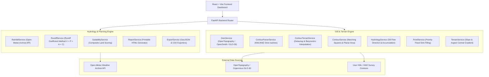

# VILLAGE POND PLANNING SYSTEM 🛰️💧

> **AI/GIS-Based Academic Decision Support System** for identifying optimal village pond construction sites using geospatial Digital Elevation Models (DEMs), vector contour survey maps (KML/KMZ), Open-Meteo historical rainfall archives, Runoff Coefficient Method volume estimation, weighted composite terrain suitability modeling, and interactive 3D/basemap visualizers.

---

## 🌟 Key Capabilities & Features

- **Dual Terrain Input Pipeline**:
  - **Select from Map** (Phase 1): Live satellite DEM acquisition (Copernicus GLO-30 / COP30 / SRTM 30m) via OpenTopography & OpenZenith for any clicked point, rectangle, or custom polygon ROI.
  - **Upload Vector Contours** (Phase 2): Accepts `.kml` and `.kmz` topographic survey files, parses strict isolines, and reconstructs a high-precision continuous elevation grid via Delaunay triangulation.
- **Basemap Imagery Switcher**: Instant switching between **ESRI World Imagery (Satellite)**, **OpenStreetMap (Street)**, and **OpenTopoMap (Topographic)** layers.
- **Marching Squares Contour Generation**: Fast contour polyline extraction at customizable intervals (**1m, 2m, 5m, 10m, 20m, 50m**) with polyline length (m/km), vertex count, and enclosed area ($m^2$/$km^2$ via planar polygon area using the Shoelace formula).
- **Slope & Aspect Engine**: Central finite difference gradient calculation (`np.gradient`) with interactive YlOrRd slope heatmap overlays.
- **D8 Hydrological Engine**:
  - D8 steepest-descent flow direction matrix calculation.
  - **Flow Accumulation Grid** calculating upstream cell counts across the entire region.
  - Water droplet flow path simulation with animated Leaflet droplets.
  - Stream network extraction at customizable accumulation thresholds.
  - Watershed catchment delineation using reverse BFS from any outlet point.
- **Open-Meteo Historical Rainfall API**:
  - Fetches 10+ years of daily precipitation records (1940–present).
  - Summarizes annual averages, monsoon totals (Jun–Sep), monthly distributions, and climate aridity classification (Arid, Semi-Arid, Sub-Humid, Humid, Very Humid).
- **Surface Runoff Estimation Engine**:
  - Calculates annual runoff volume using the **Runoff Coefficient Method** ($V = P \times A \times C$), distinct from the classical peak discharge Rational Method ($Q = C \cdot i \cdot A$).
  - Configurable land-use presets ($C = 0.15 \dots 0.85$).
- **Candidate Pond Site Detection & Suitability Scoring**:
  - Identifies top-N candidate pond sites across the region with minimum spatial separation.
  - Weighted composite suitability scoring ($0 \dots 100$) based on slope, depression depth, flow accumulation, elevation, and rainfall.
  - Tier classification (**Recommended**, **Highly Suitable**, **Moderately Suitable**, **Poor**) with explicit "Why This Site?" reasons.
- **Draggable & Minimizable Control Panels**:
  - Universal floating panels (Candidate Sites, Recommendation, Hydrology Inspector, DEM Stats, Terrain Input) with drag-and-drop headers, collapse/minimize toggle, and close buttons.
- **Recommendation Dashboard & Panels**:
  - Interactive **Recommendation Panel** featuring score breakdown ring, depth/volume/surface estimates, and map auto-focus.
  - **Candidate Sites Drawer** listing all ranked sites with tier colors and direct export buttons.
- **Printable Analysis Report Generation**:
  - HTML report generator producing print-ready planning documents complete with location maps, DEM stats, rainfall charts, runoff formulas, candidate site tables, methodology, and data source citations.
- **Data Exporting**:
  - Contours: GeoJSON / CSV
  - Candidate Pond Sites: GeoJSON / CSV
  - Watershed Catchment Boundary: GeoJSON
  - Elevation Profile Transects: CSV

---

## 🏗️ System Architecture



---

## 📐 Mathematical & Hydrological Foundations

### 1. Contour Generation (Marching Squares)
Each grid cell formed by 4 neighboring DEM elevation values $[E_{00}, E_{01}, E_{10}, E_{11}]$ is classified against a target elevation threshold $C$. Each vertex produces a 1-bit binary flag:

$$b_i = \begin{cases} 1 & \text{if } E_i \ge C \\ 0 & \text{if } E_i < C \end{cases}$$

The 4-bit index $k = \sum_{i=0}^3 b_i 2^i \in [0, 15]$ indexes a lookup table to place interpolated contour line segment endpoints along cell edges via linear interpolation:

$$t = \frac{C - E_A}{E_B - E_A} \implies P = (1 - t)P_A + t P_B$$

### 2. Terrain Reconstruction from Contours (Delaunay & Barycentric Interpolation)
For vector contour vertices $(x_k, y_k, z_k)$, a 2D Delaunay triangulation is constructed. For any regular grid query coordinate $(x, y)$ falling inside a triangle $(P_1, P_2, P_3)$ with barycentric coordinates $(\lambda_1, \lambda_2, \lambda_3)$ where $\sum \lambda_i = 1$:

$$z(x, y) = \lambda_1 z_1 + \lambda_2 z_2 + \lambda_3 z_3$$

Points outside the convex hull of the contour survey are filled via nearest-neighbor extrapolation to guarantee zero missing (`NaN`) values.

### 3. Physical Distance & Planar Area Calculations
- **Haversine Geodesic Distance**:
  $$d = 2 R \arcsin \left( \sqrt{ \sin^2\left(\frac{\Delta \phi}{2}\right) + \cos(\phi_1) \cos(\phi_2) \sin^2\left(\frac{\Delta \lambda}{2}\right) } \right)$$
  where $R = 6371 \text{ km}$.
- **Planar Polygon Area**: Polygons are projected onto planar meter coordinates at the centroid latitude ($\phi_c$) using scale factors:
  $$\Delta y = \Delta \phi \times 111,000 \text{ m}, \quad \Delta x = \Delta \lambda \times 111,000 \cos(\phi_c) \text{ m}$$
  Enclosed planar polygon area is computed via the Shoelace formula:
  $$\text{Area} = \frac{1}{2} \left| \sum_{i=1}^{n-1} (x_i y_{i+1} - x_{i+1} y_i) + (x_n y_1 - x_1 y_n) \right|$$

### 4. Slope & Aspect Field
Local elevation gradients $\frac{\partial E}{\partial x}$ and $\frac{\partial E}{\partial y}$ are computed using central finite differences (`np.gradient`):

$$\text{Slope} = \arctan \sqrt{\left(\frac{\partial E}{\partial x}\right)^2 + \left(\frac{\partial E}{\partial y}\right)^2} \times \frac{180^\circ}{\pi}$$

$$\text{Aspect} = \left( 450^\circ - \text{atan2}\left(-\frac{\partial E}{\partial y}, \frac{\partial E}{\partial x}\right) \times \frac{180^\circ}{\pi} \right) \bmod 360^\circ$$

### 5. Hillshade Shading Formulation
Simulates 3D surface illumination from a virtual light source at azimuth $\phi_0$ ($315^\circ$ NW) and solar altitude $\alpha_0$ ($45^\circ$):

$$\text{Illumination} = \sin(\alpha_0) \cos(\beta) + \cos(\alpha_0) \sin(\beta) \cos(\phi_0 - \theta)$$

where $\beta$ is terrain slope and $\theta$ is terrain aspect.

*(Note: On flat agricultural plains where $\text{Slope} \approx 0^\circ$, illumination evaluates uniformly to $\sin(45^\circ) \approx 0.707$, producing uniform soft lighting; in steep terrain, it creates deep shadow relief).*

### 6. D8 Flow Direction & Flow Accumulation
Flow direction is assigned to the neighbor in the $3 \times 3$ cell window with maximum downward gradient:

$$\text{Drop}_{i,j} = \frac{E_{\text{center}} - E_{i,j}}{\text{Distance}_{i,j}}$$

Flow accumulation ($A_{\text{cell}}$) is computed iteratively via topological sorting of the flow DAG, accumulating the total upstream contributing cell count.

### 7. Depression Sink Filling & Stage-Storage Formulation
Depression sinks are identified using the Priority-Flood algorithm (Wang & Liu 2006). Pond storage volume at target water level elevation $z$ is derived using raster grid summation:

$$V(z) = \sum_{i} \max(0, z - E_i) \, \Delta A_i$$

where $E_i$ is the elevation of cell $i$ and $\Delta A_i = \Delta x \cdot \Delta y$ is the grid cell surface area in $\mathrm{m}^2$. The resulting relationship $z \to V(z)$ is evaluated across discrete depth levels as a **Stage-Storage Curve**.

### 8. Surface Runoff Estimation (Runoff Coefficient Method)
Annual surface runoff volume ($V$) is estimated using:

$$V = P \times A \times C$$

Where:
- $P$ = Annual rainfall depth ($\mathrm{m}$)
- $A$ = Catchment area ($\mathrm{m}^2$)
- $C$ = Dimensionless runoff coefficient ($0.05 \le C \le 0.95$)

*Note: This estimates total seasonal volume $V = P \times A \times C$, distinct from the classical peak discharge Rational Method ($Q = C \cdot i \cdot A$, where $i$ is rainfall intensity).*

### 9. Land Suitability Scoring Model
Each DEM grid cell is evaluated across 5 normalized score components ($S_i \in [0, 1]$):
1. **Slope Score**: $S_{\text{slope}} = \frac{1}{1 + \text{slope} / 8.0}$ (lower slope $\to$ higher score)
2. **Depression Score**: $S_{\text{dep}} = \frac{\text{fill depth}}{\max(\text{fill depth})}$ (deeper natural basin $\to$ higher score)
3. **Catchment Score**: $S_{\text{cat}} = \frac{\ln(1 + A_{\text{cell}})}{\max(\ln(1 + A_{\text{cell}}))}$ (larger upstream area $\to$ higher score)
4. **Elevation Score**: $S_{\text{elev}} = 1 - \frac{E - E_{\min}}{E_{\max} - E_{\min}}$ (lower terrain $\to$ higher gravity drainage)
5. **Rainfall Score**: $S_{\text{rain}} = \min(1, \text{Rainfall} / 800)$

Composite Suitability Score ($S \in [0, 100]$):

$$S = 100 \times \sum_{i=1}^5 w_i S_i \quad \text{where } \sum_{i=1}^5 w_i = 1.0$$

Itemized Points Breakdown out of 100:
- Slope: up to 20 pts
- Depression Depth: up to 20 pts
- Catchment & Flow: up to 25 pts
- Elevation Lowness: up to 15 pts
- Rainfall Depth: up to 20 pts

---

## 🛠️ Technology Stack

- **Backend Framework**: Python 3.12, FastAPI, Uvicorn, Pydantic v2.
- **GIS & Numerical Computing**: NumPy, SciPy, Rasterio, Shapely, PyProj, Scikit-Image, OpenCV, Pillow.
- **Frontend Framework**: React 18, Vite, TypeScript, Tailwind CSS.
- **Map & Visualization Engine**: Leaflet, React-Leaflet, Plotly.js, React-Plotly.js, Lucide-React.
- **Testing**: PyTest (**94 automated unit & integration tests**: 59 Phase 1 + 30 Phase 2 + 5 Determinism & Hydrology). See [ASSIGNMENT_VALIDATION.md](file:///c:/Users/Abhigyan%20Sharma/OneDrive/Desktop/Contour/ASSIGNMENT_VALIDATION.md) and [PHASE_2.md](file:///c:/Users/Abhigyan%20Sharma/OneDrive/Desktop/Contour/PHASE_2.md).

---

## 🚀 Quick Start (Local Setup)

### Prerequisites
- Python 3.10+
- Node.js 18+

### 1. Clone & Setup Backend
```bash
# Navigate to project root
cd Contour

# Install Python dependencies
pip install -r backend/requirements.txt

# Run automated tests
python -m pytest backend/tests/ -v

# Launch FastAPI server
python -m uvicorn backend.main:app --port 8000 --reload
```
Backend API interactive docs available at: `http://localhost:8000/docs`

### 2. Setup & Launch Frontend
```bash
cd frontend

# Install Node dependencies
npm install

# Build production bundle (or run dev server)
npm run build
npm run dev
```
Open browser at: `http://localhost:3000`

---

## 📡 API Reference

| Method | Endpoint | Description |
| :--- | :--- | :--- |
| `POST` | `/api/dem/download-dem` | Fetches DEM raster data for point, rect, or polygon ROI |
| `POST` | `/api/contours/generate-contours` | Runs Marching Squares contour polyline extraction (1m–50m) |
| `POST` | `/api/terrain/slope` | Computes slope heatmap PNG overlay |
| `POST` | `/api/hydrology/flow-droplet` | Traces D8 steepest descent water droplet path |
| `POST` | `/api/hydrology/watershed` | Delineates upstream watershed catchment polygon |
| `POST` | `/api/hydrology/flow-vectors` | Returns D8 flow direction vector grid |
| `POST` | `/api/hydrology/stream-network` | Extracts stream channels above threshold |
| `POST` | `/api/rainfall/historical` | Fetches daily precipitation records from Open-Meteo |
| `POST` | `/api/runoff/estimate` | Calculates surface runoff volume via Runoff Coefficient Method |
| `POST` | `/api/suitability/analyze` | Scores terrain and returns ranked candidate pond sites |
| `POST` | `/api/analysis/pond` | Calculates pond depth & Stage-Storage Curve |
| `POST` | `/api/analysis/elevation-profile` | Samples DEM along transect line using bilinear interpolation |
| `POST` | `/api/analysis/terrain-3d` | Generates 3D surface mesh for Plotly rendering |
| `POST` | `/api/report/generate` | Generates printable HTML planning report |
| `POST` | `/api/export/contours/geojson` | Downloads contours as standard GeoJSON |
| `POST` | `/api/export/contours/csv` | Downloads contour statistics table as CSV |
| `POST` | `/api/export/candidates/csv` | Downloads candidate pond sites as CSV |
| `POST` | `/api/export/catchment/geojson` | Downloads watershed catchment boundary as GeoJSON |
| `POST` | `/api/export/pond-sites/geojson` | Downloads candidate pond sites as GeoJSON Points |
| `POST` | `/api/contour-analysis/analyzeContour` | **Phase 2**: Accepts KML/KMZ contour map, reconstructs DEM, identifies pond site & delineates catchment |
| `POST` | `/api/contour-analysis/findCatchment` | **Phase 2**: Alias for `/analyzeContour` |

---

## 🗺️ Phase 2: KML/KMZ Contour Upload & Analysis

The Village Pond Planning System provides a dual-input pipeline:
1. **Select from Map**: Fetch live satellite DEMs from OpenTopography/OpenZenith for any clicked point or polygon ROI.
2. **Upload Contours (KML/KMZ)**: Upload vector contour isolines (`.kml` or `.kmz`), dynamically reconstruct a continuous elevation raster (DEM) via Delaunay triangulation (`scipy.interpolate.LinearNDInterpolator`), and feed directly into the common D8 hydrology and suitability ranking engine.

See [PHASE_2.md](PHASE_2.md) for full architectural documentation, mathematical formulation, and API specification.

---

## 📜 Academic Disclaimer
This software is designed as a **planning-level decision support system**. All runoff, storage volume, and suitability site estimates are computed using publicly available digital elevation models and climate reanalysis data. They are intended for preliminary screening and require field survey verification prior to engineering construction.

